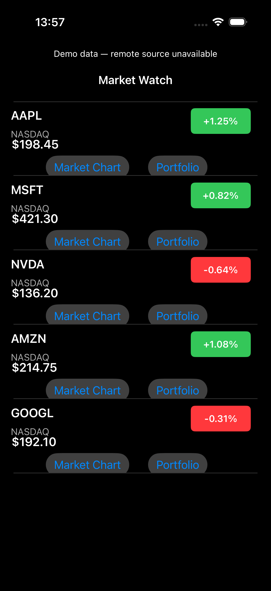
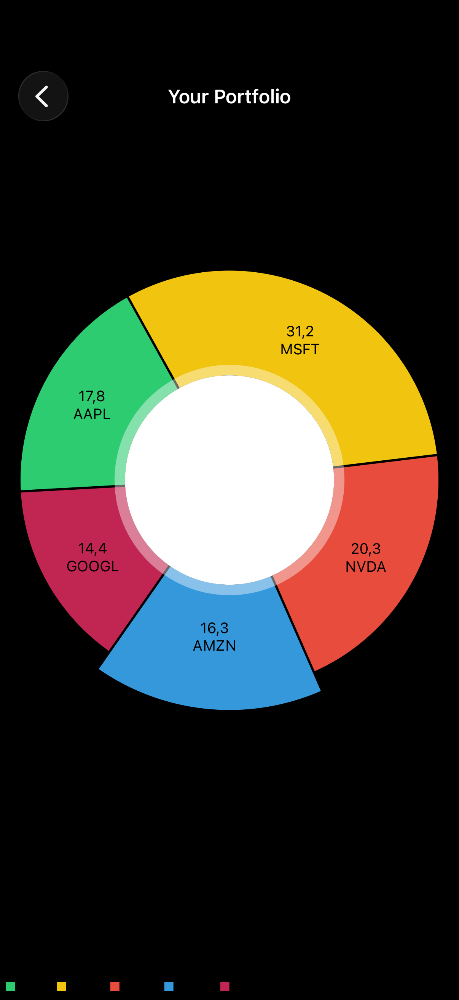
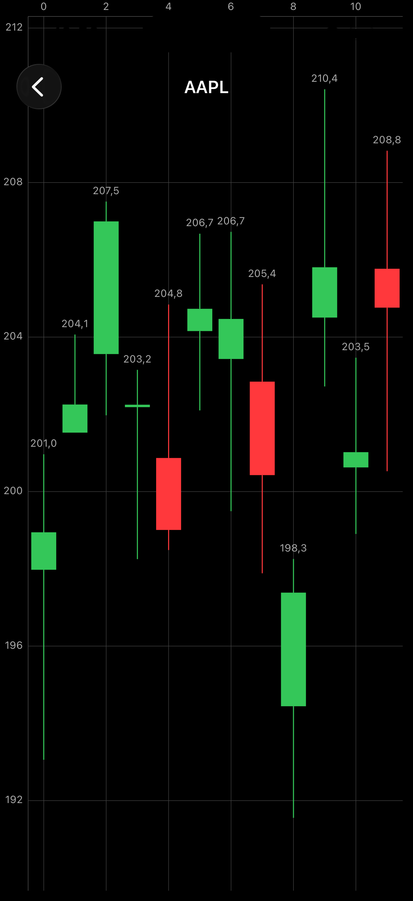
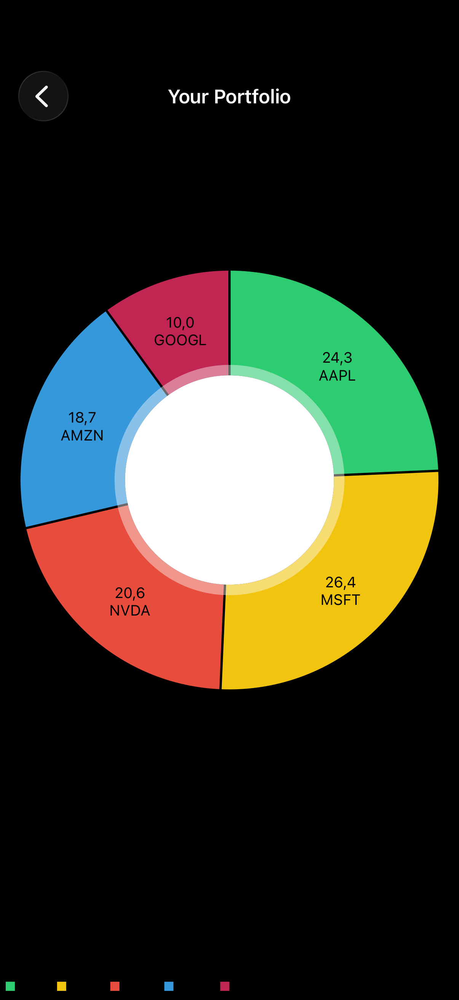

# iOS Stock Trading App with Swift and Charts

An educational iOS stock-market application developed for **Course 1: Build an iOS Stock Trading App with Swift & Charts** in the **Build Professional iOS Apps with Swift Programming Specialization** on Coursera.

The project demonstrates how to organize financial market data, display stocks in custom table views, synchronize portfolio actions across interface components, and present financial information through candlestick and pie charts.

> This is a learning and portfolio project. It does not connect to a brokerage, execute real trades, or provide financial advice.

## Project purpose

The application provides a practical example of building a data-driven iOS interface with Swift and UIKit. It combines mock JSON data, network requests, structured models, reusable table-view cells, delegation, charts, colors, and animations in one cohesive project.

## Features

* Display a list of stocks in a custom table view
* Parse mock JSON into structured Swift models
* Retrieve and process data with Alamofire
* Update interface elements when data changes
* Present portfolio-aware stock information
* Handle buy, sell, or portfolio actions through delegation
* Keep custom cells and view controllers synchronized
* Display historical price movements with candlestick charts
* Present portfolio allocation with pie charts
* Transform and filter data with higher-order functions
* Apply custom colors to improve financial-data readability
* Animate chart updates and interface transitions

## Application components

| Component                   | Responsibility                                            |
| --------------------------- | --------------------------------------------------------- |
| **Data models**             | Represent stocks, prices, and portfolio information       |
| **Networking layer**        | Retrieves and processes JSON data with Alamofire          |
| **View controllers**        | Coordinate screens, data flow, and user interactions      |
| **Custom table-view cells** | Present stock information and portfolio actions           |
| **Delegates**               | Pass cell actions back to the appropriate view controller |
| **Chart views**             | Visualize price history and portfolio composition         |

## Architecture and patterns

The project uses UIKit-oriented application design with clear separation between data, interface components, and interaction handling.

* Structured Swift data models
* View controllers for screen coordination
* Reusable `UITableViewCell` subclasses
* Delegate protocols for cell-to-controller communication
* Data-source methods for table-view rendering
* Networking separated from interface updates
* Higher-order functions for data transformation

## Technologies

* Swift
* UIKit
* Xcode
* iOS 12 project target
* UITableView
* Custom table-view cells
* Alamofire
* JSON
* Codable or structured model mapping
* Delegate pattern
* Candlestick charts
* Pie charts
* Higher-order functions
* Core Animation and UIKit animations
* Git and GitHub

## Course modules

### Module 1 — Building the Foundation of a Stock App

The first module establishes the application’s core structure and data flow.

* Configure the Xcode project
* Prepare mock JSON data
* Define stock-related data models
* Add networking with Alamofire
* Configure a table view
* Display financial information in reusable cells

### Module 2 — Interactive Stock Views and Charts

The second module adds interaction and financial visualization.

* Build portfolio-aware stock cells
* Create delegate protocols for user actions
* Send events from cells to view controllers
* Synchronize portfolio data and visible interface state
* Configure candlestick charts for price data

### Module 3 — Data Visualization and Animations

The final module improves data interpretation and presentation.

* Build pie charts for portfolio allocation
* Transform data with higher-order functions
* Customize chart and category colors
* Animate chart updates
* Refine the overall user experience

## Data flow

1. The application loads stock information from mock or network-provided JSON.
2. The response is converted into structured Swift models.
3. A view controller supplies the models to the table-view data source.
4. Custom cells display stock and portfolio information.
5. Cell actions are forwarded through delegate methods.
6. The controlling screen updates the portfolio state and visible cells.
7. Chart data is calculated and rendered as candlestick or pie charts.
8. Animations communicate data and interface changes.

## Project structure

```text
StockTradingApp/
├── StockTradingApp.xcodeproj
└── StockTradingApp/
    ├── AppDelegate.swift
    ├── Models/
    ├── Networking/
    ├── ViewControllers/
    ├── Views/
    ├── Cells/
    ├── Resources/
    └── Assets.xcassets
```

The folders above show a recommended logical organization. The exact structure may differ from the completed Xcode project.

## Screenshots

Add screenshots to a `Screenshots` folder and update the filenames if necessary.

<p align="center">
  
  
  
  
</p>

## Requirements

* macOS with a compatible version of Xcode
* An iOS Simulator or supported physical device
* Swift and UIKit support
* The Alamofire version configured by the project
* The charting dependency configured by the project
* Network access if the selected data source is remote

Because the course targets iOS 12, dependency versions should remain compatible with the deployment target used by the original project.

## Running the project

1. Clone or download the repository.
2. Open the Xcode project or workspace included with the application.
3. Install dependencies using the package-management method configured by the project.
4. Select a compatible iPhone Simulator or physical device.
5. Review signing settings if running on a physical device.
6. Build and run with **Product → Run** or `Command + R`.

If the project uses CocoaPods, open the `.xcworkspace` file instead of the `.xcodeproj` file after installing the pods.

## Verification checklist

* [ ] The project builds without errors.
* [ ] Mock or remote stock data loads correctly.
* [ ] JSON data is converted into the expected models.
* [ ] The stock table displays the correct values.
* [ ] Custom cells update without layout issues.
* [ ] Delegate actions reach the correct view controller.
* [ ] Portfolio changes update the visible interface.
* [ ] Candlestick data appears in the correct order.
* [ ] The pie chart represents portfolio proportions correctly.
* [ ] Chart colors remain clear and consistent.
* [ ] Animations run smoothly without blocking interaction.

## Skills demonstrated

* Building UIKit applications with Swift
* Designing custom table-view cells
* Modeling and processing financial data
* Integrating Alamofire networking
* Applying the delegate pattern
* Synchronizing state across interface components
* Using higher-order functions for data transformation
* Creating candlestick and pie-chart visualizations
* Customizing colors and animations
* Debugging a multi-component iOS application

## Course information

* **Specialization:** Build Professional iOS Apps with Swift Programming
* **Course:** Build an iOS Stock Trading App with Swift & Charts
* **Course position:** 1 of 5
* **Provider:** EDUCBA
* **Platform:** Coursera
* **Level:** Intermediate
* **Language:** English
* **Taught by:** EDUCBA

## Disclaimer

This repository contains an independent educational implementation created for coursework and portfolio demonstration. It is not an official EDUCBA, Coursera, Apple, or Alamofire repository. The application is a software-development exercise and is not intended for live trading, investment decisions, or financial advice.

