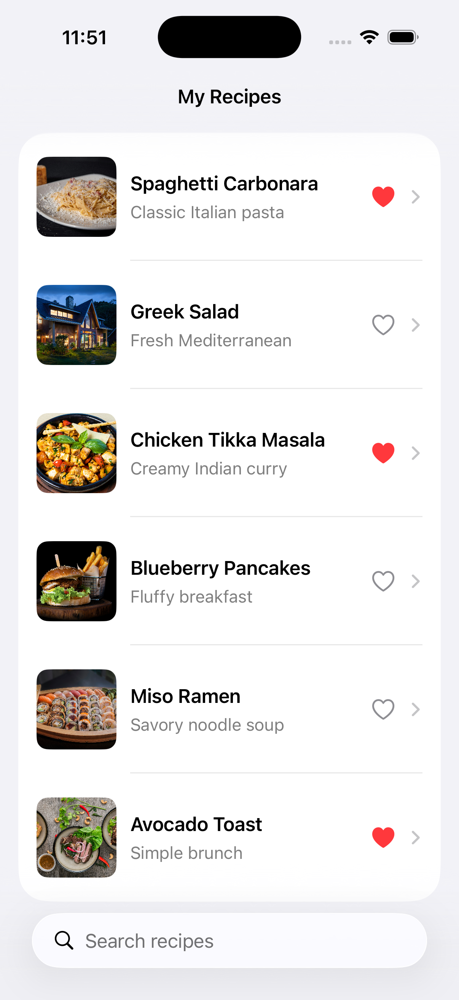
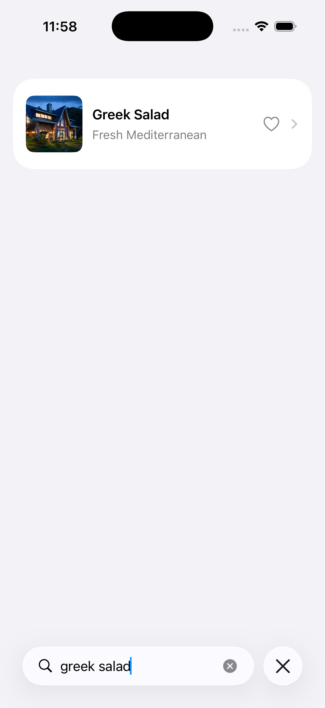
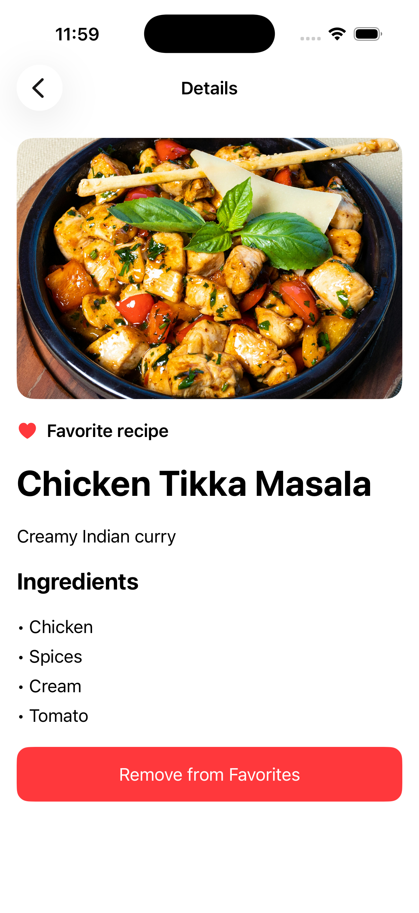

# Recipe App with SwiftUI

A portfolio project completed for **Course 1: Get Started with iOS App Development** in the **IBM Developing iOS Apps with Swift Specialization** on Coursera.

The application is a multi-screen recipe browser built entirely with SwiftUI. Users can browse recipes, search by name, view complete recipe information, and manage favorites from both the list and detail screens.

## Features

* Scrollable recipe list with images, names, and descriptions
* Real-time recipe filtering using a native search bar
* Ability to mark and unmark recipes as favorites
* Detailed recipe screen with an image, description, and ingredients
* Consistent favorite state between the list and detail screens
* Navigation using `NavigationStack` and `NavigationLink`
* Asynchronous image loading with placeholders
* SwiftUI previews for the main views

## Screenshots

<p align="center">
  
  
  
</p>

## User stories

1. As a user, I can view a list of available recipes.
2. As a user, I can search for recipes by name.
3. As a user, I can open a recipe and view its complete details.
4. As a user, I can mark a recipe as a favorite from the recipe list.
5. As a user, I can change the favorite status from the detail screen.
6. As a user, I can return from the detail screen to the recipe list.

## Screens and components

| Component          | Purpose                                                         |
| ------------------ | --------------------------------------------------------------- |
| `ContentView`      | Displays the searchable recipe list and manages recipe data     |
| `RecipeRowView`    | Presents a recipe image, name, description, and favorite button |
| `RecipeDetailView` | Displays full recipe information and favorite status            |
| `Recipe`           | Defines the identifiable data model used throughout the app     |

## Technologies

* Swift
* SwiftUI
* Xcode
* iOS Simulator
* SF Symbols

## SwiftUI concepts

* `NavigationStack`
* `NavigationLink`
* `List` and `ForEach`
* `HStack` and `VStack`
* `AsyncImage`
* `@State` and `@Binding`
* `Identifiable`
* `.searchable()`
* Closures
* View modifiers
* `#Preview`

## Data model

Each recipe contains the following properties:

| Property      | Description                     |
| ------------- | ------------------------------- |
| `id`          | Unique recipe identifier        |
| `name`        | Recipe name                     |
| `description` | Short description of the recipe |
| `ingredients` | List of required ingredients    |
| `imageURL`    | URL of the recipe image         |
| `isFavorite`  | Current favorite status         |

The project uses six sample recipes stored in memory. It does not require a database or external API.

## Project structure

```text
Recipe-App/
├── README.md
├── RecipeApp.xcodeproj
└── RecipeApp/
    ├── RecipeApp.swift
    ├── ContentView.swift
    ├── RecipeRowView.swift
    ├── RecipeDetailView.swift
    └── Assets.xcassets
```

## Application flow

1. The application opens with a list of recipes.
2. The user can enter text in the search field.
3. The recipe list updates immediately to show matching results.
4. Selecting a recipe opens its detail screen.
5. The user can change the favorite status from either screen.
6. The standard navigation button returns the user to the recipe list.

## Requirements

* macOS with Xcode installed
* Swift and SwiftUI support
* An iOS Simulator supported by the installed Xcode version
* Internet access for loading remote recipe images

## Running the project

1. Clone or download the repository.
2. Open `RecipeApp.xcodeproj` in Xcode.
3. Select an available iPhone Simulator.
4. Build and run the project using **Product → Run** or `Command + R`.
5. Verify the recipe list, search, navigation, images, and favorite controls.

## Verification checklist

* [ ] The recipe list appears when the application opens.
* [ ] Every recipe displays a name, description, and image.
* [ ] Search results update while text is entered.
* [ ] Selecting a recipe opens the correct detail screen.
* [ ] The detail screen displays the recipe image and ingredients.
* [ ] The favorite button works in the recipe list.
* [ ] The favorite button works on the detail screen.
* [ ] Favorite status remains consistent between both screens.
* [ ] The back button returns to the recipe list.
* [ ] SwiftUI previews are available for all primary views.

## Learning outcomes

This project demonstrates the ability to:

* Build a multi-screen application with SwiftUI
* Model structured application data with `Identifiable`
* Create reusable SwiftUI views
* Build interfaces using lists and stack layouts
* Pass mutable data using `@Binding`
* Manage view state using `@State`
* Implement real-time search filtering
* Load remote images asynchronously
* Implement navigation between application screens
* Preview and test views in Xcode
* Run and verify an application in the iOS Simulator

## Course information

* **Specialization:** Developing iOS Apps with Swift
* **Provider:** IBM
* **Platform:** Coursera
* **Course:** Get Started with iOS App Development
* **Project:** Recipe App with SwiftUI
* **Taught by::** Ramanujam Srinivasan and SkillUp

## Disclaimer

This repository contains an independent educational implementation created for coursework and portfolio demonstration. IBM and Coursera are trademarks of their respective owners.
