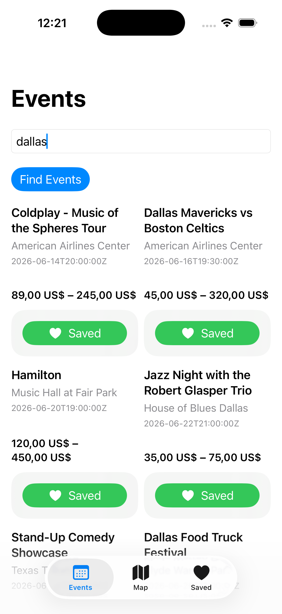
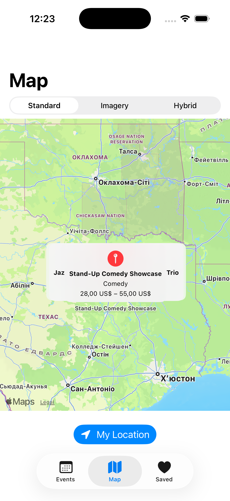
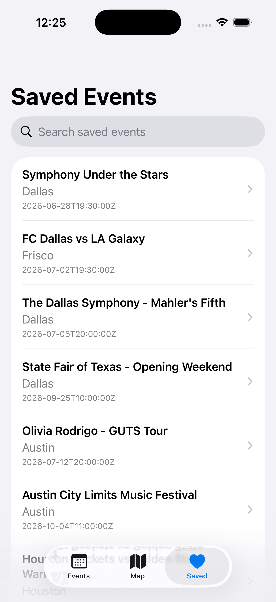

# Local Events Explorer

A portfolio-ready iOS application developed as the final project for **Course 2: Creating iOS Apps Using Swift** in the **IBM Developing iOS Apps with Swift Specialization** on Coursera.

Local Events Explorer is a multi-screen SwiftUI application for discovering upcoming events, searching by city, exploring event locations on a map, and saving favorite events for later. It combines networking, local persistence, maps, charts, animations, and AI-assisted recommendations in an MVVM-based architecture.

## Features

* Browse events loaded from a hosted JSON source
* Search and filter events by city
* View responsive event cards in an adaptive grid
* Explore event locations with interactive MapKit annotations
* Switch between standard, imagery, and hybrid map styles
* Center the map on the user’s current location
* Save and remove favorite events
* Persist saved events between launches with SwiftData
* Search and delete items from the Saved tab
* Review ticket-price information with Swift Charts
* Generate event tips with Apple Foundation Models
* Display fallback recommendations when AI generation is unavailable
* Handle loading, empty, error, and retry states
* Present staggered card animations and smooth transitions
* Support future localization through exported localization resources

## Application tabs

| Tab        | Purpose                                                                                    |
| ---------- | ------------------------------------------------------------------------------------------ |
| **Events** | Loads events, provides city search, and displays event cards                               |
| **Map**    | Shows event locations, map-style controls, and user-location support                       |
| **Saved**  | Stores favorite events and provides search, deletion, details, charts, and recommendations |

## Architecture

The project follows the **Model–View–ViewModel (MVVM)** pattern:

* **Models** represent remote events, persisted events, API responses, and generated tips.
* **Views** build the user interface with SwiftUI.
* **View models** manage loading, filtering, state, and errors.
* **Services** perform asynchronous networking and JSON decoding.
* **SwiftData** provides local persistence for saved events.

## Main components

| Component                    | Responsibility                                            |
| ---------------------------- | --------------------------------------------------------- |
| `Event.swift`                | Defines the remote event model and JSON key mappings      |
| `EventsResponse.swift`       | Represents the decoded events response                    |
| `SavedEvent.swift`           | Defines the SwiftData model for persisted events          |
| `EventTip.swift`             | Defines structured AI-generated event recommendations     |
| `EventsService.swift`        | Fetches, validates, and decodes event data                |
| `EventsViewModel.swift`      | Manages networking, filtering, loading, and errors        |
| `ContentView.swift`          | Provides the Events, Map, and Saved tabs                  |
| `EventCard.swift`            | Displays a reusable event summary and save control        |
| `EventsMapView.swift`        | Displays map annotations, styles, and user location       |
| `SavedEventsView.swift`      | Lists, searches, and deletes saved events                 |
| `SavedEventDetailView.swift` | Displays details, price charts, and event recommendations |

## Technologies

* Swift
* SwiftUI
* MVVM
* Observation framework with `@Observable`
* URLSession
* Swift concurrency with `async/await`
* Codable
* MapKit
* Core Location
* SwiftData
* Swift Charts
* Apple Foundation Models
* SF Symbols
* Xcode localization tools

## Data flow

1. `EventsService` requests event data from the hosted JSON endpoint.
2. The response is validated and decoded into event models.
3. `EventsViewModel` publishes loading, event, filtering, and error state.
4. The Events tab displays matching events in an adaptive grid.
5. Map data is passed to the Map tab and rendered as annotations.
6. Saving an event inserts a `SavedEvent` into the SwiftData context.
7. The Saved tab retrieves persisted events with `@Query`.
8. The detail screen presents event information, price charts, and generated or fallback tips.

## Project structure

```text
LocalEventsExplorer/
├── LocalEventsExplorer.xcodeproj
└── LocalEventsExplorer/
    ├── LocalEventsExplorerApp.swift
    ├── ContentView.swift
    ├── Models/
    │   ├── Event.swift
    │   ├── EventsResponse.swift
    │   ├── SavedEvent.swift
    │   └── EventTip.swift
    ├── Services/
    │   └── EventsService.swift
    ├── ViewModels/
    │   └── EventsViewModel.swift
    ├── Views/
    │   ├── EventCard.swift
    │   ├── EventsMapView.swift
    │   ├── SavedEventsView.swift
    │   └── SavedEventDetailView.swift
    └── Assets.xcassets
```

The folders shown above describe the logical organization of the project. The exact Xcode group structure may differ.

## Screenshots

Add application screenshots to a `Screenshots` folder and update the filenames below if necessary.

<p align="center">
  
  
  
</p>

## Requirements

* macOS with a compatible version of Xcode
* An iOS Simulator or supported physical device
* SwiftUI, SwiftData, MapKit, and Charts support
* Network access for retrieving event data
* Location permission for user-location features
* A supported device and operating system for Apple Foundation Models

> Apple Foundation Models may be unavailable in some simulator or device configurations. The application provides fallback recommendations when model-based generation cannot run.

## Running the project

1. Clone or download the repository.
2. Open `LocalEventsExplorer.xcodeproj` in Xcode.
3. Select a compatible iPhone Simulator or physical device.
4. Review the signing settings if running on a physical device.
5. Build and run with **Product → Run** or `Command + R`.
6. Allow location access if you want to test current-location functionality.

## Verification checklist

* [ ] The project builds without errors.
* [ ] Remote events load and decode correctly.
* [ ] City search filters the displayed events.
* [ ] Loading, error, and retry states behave correctly.
* [ ] Event cards animate into the grid.
* [ ] Map annotations represent event locations.
* [ ] Map-style switching works.
* [ ] Current-location support works when permission is granted.
* [ ] Events can be saved and removed.
* [ ] Saved events remain available after restarting the application.
* [ ] Saved-event search and swipe-to-delete work.
* [ ] The detail screen displays ticket-price charts.
* [ ] AI-generated or fallback event tips are displayed.
* [ ] Localization resources can be exported from Xcode.

## Learning outcomes

This project demonstrates the ability to:

* Build a multi-tab, multi-screen SwiftUI application
* Apply MVVM architecture with observable view models
* Fetch and decode JSON using URLSession and Swift concurrency
* Validate network responses and present recoverable errors
* Integrate interactive maps and location services
* Persist and query user data with SwiftData
* Visualize data with Swift Charts
* Integrate structured AI-generated content with graceful fallbacks
* Create reusable and accessible SwiftUI components
* Add polished animations and transitions
* Prepare an application for localization

## Course information

* **Specialization:** Developing iOS Apps with Swift
* **Provider:** IBM
* **Platform:** Coursera
* **Course:** Creating iOS Apps Using Swift
* **Final project:** Local Events Explorer
* **Taught by:**Ramanujam Srinivasan and SkillUp

## Disclaimer

This repository contains an independent educational implementation created for coursework and portfolio demonstration. IBM, Coursera, and Apple are trademarks of their respective owners.

