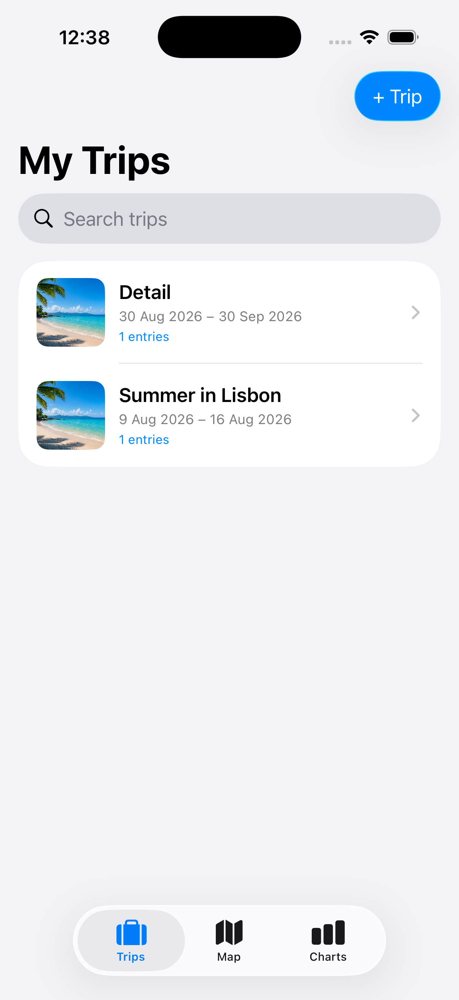
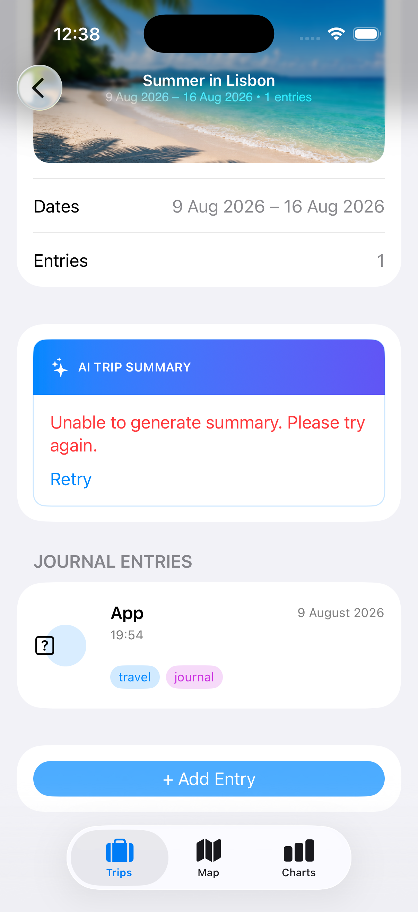
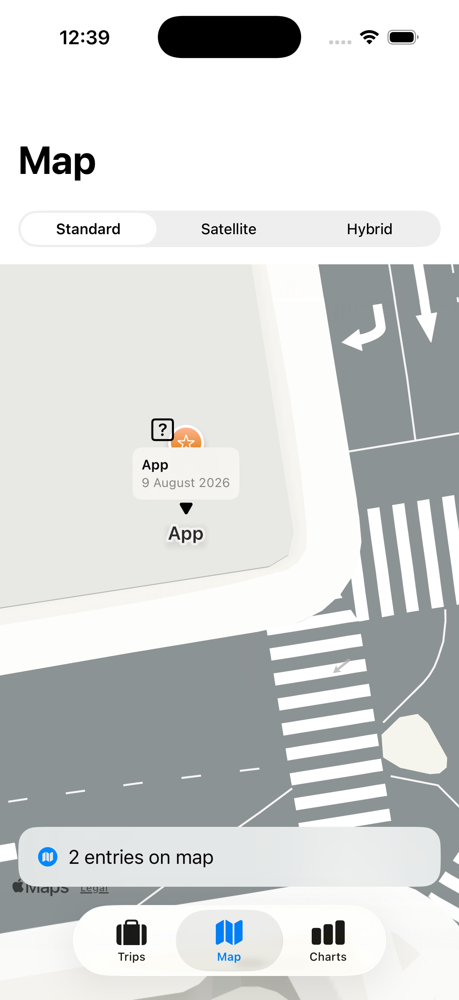
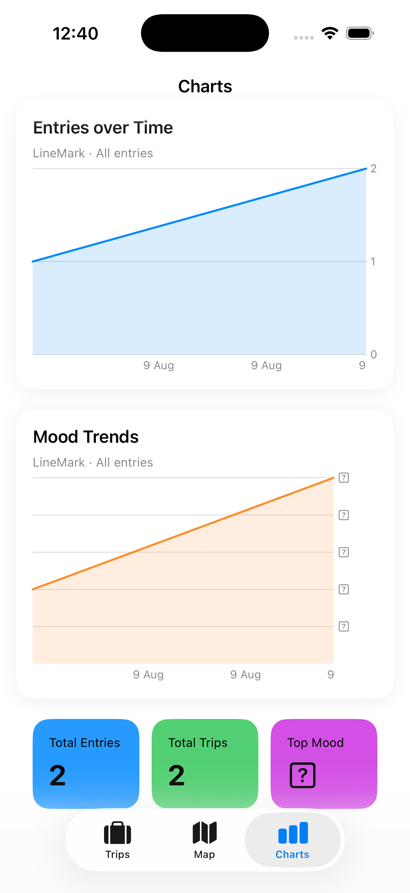

# Smart Travel Journal

A portfolio-ready iOS application developed as the capstone project for the **IBM Developing iOS Apps with Swift Specialization** on Coursera.

Smart Travel Journal helps travelers organize and preserve their experiences in one application. Users can create trips, record journal entries, attach photographs, save locations, review weather information, visualize travel data, and revisit previous journeys through a structured SwiftUI interface.

## Project purpose

Travel memories are often distributed across photo libraries, notes, maps, and other applications. Smart Travel Journal brings these elements together in a single digital journal so users can document, organize, and explore their trips more easily.

The project demonstrates how modern Apple frameworks can be combined to build a feature-rich, user-centered iOS application from initial concept to a portfolio-ready result.

## Target audience

* Frequent travelers
* Travel enthusiasts
* Students studying abroad
* Travel bloggers
* Adventure seekers
* Users interested in digital journaling

## Features

* Create, view, edit, and organize trips
* Add journal entries and personal reflections
* Attach and manage travel photographs
* Save destinations and geographic coordinates
* Display trip locations with MapKit
* Request location access with Core Location
* Retrieve current weather information asynchronously
* Persist trips and journal data locally with SwiftData
* Search and navigate through saved travel experiences
* Visualize trip-related information with Swift Charts
* Generate AI-assisted trip summaries and content tags
* Present loading, empty, and error states
* Use animations and transitions for a polished experience
* Support accessible labels and scalable interface elements

## Core user experience

1. The user creates a new trip and enters its essential information.
2. The trip is saved locally and remains available after the application restarts.
3. The user adds journal entries, photographs, reflections, and locations.
4. MapKit presents the trip destination or recorded locations visually.
5. The application retrieves relevant weather information when network access is available.
6. Charts summarize selected trip information.
7. AI features generate a trip summary or descriptive tags when supported.
8. The user can return later to review and update the travel journal.

## Architecture

The project uses the **Model–View–ViewModel (MVVM)** pattern to separate data, presentation, and application logic.

| Layer           | Responsibility                                                           |
| --------------- | ------------------------------------------------------------------------ |
| **Models**      | Represent trips, journal entries, weather information, and related data  |
| **Views**       | Build the interface and navigation flows with SwiftUI                    |
| **View models** | Manage state, validation, loading, and interaction logic                 |
| **Services**    | Handle networking, weather requests, location access, and AI integration |
| **Persistence** | Stores user-created travel data with SwiftData                           |

## Technologies

* Swift
* SwiftUI
* Xcode
* MVVM
* SwiftData
* MapKit
* Core Location
* URLSession
* Swift concurrency with `async/await`
* Codable
* Swift Charts
* Apple Foundation Models
* Photos and asset management
* SF Symbols
* Accessibility APIs
* Git and GitHub

## Technical highlights

### Data persistence

SwiftData stores trips and journal entries locally. Model relationships allow the application to connect journal content with the appropriate trip while keeping the data available between launches.

### Maps and location

MapKit displays destinations and saved locations. Core Location provides permission-aware access to location services while respecting the user’s privacy choices.

### Networking and weather

The networking layer uses `URLSession`, `Codable`, and `async/await` to request and decode weather information. Loading and error states provide feedback when data is unavailable.

### Charts

Swift Charts transforms travel information into clear visual summaries, providing an additional way to review recorded experiences.

### AI-assisted content

Apple Foundation Models can generate concise trip summaries and useful content tags. Availability checks and fallback behavior keep the application functional when model-based generation is unavailable.

### Accessibility and interface design

The interface uses clear navigation, consistent layouts, accessible labels, scalable text, and familiar SwiftUI controls. Animations reinforce state changes without replacing essential feedback.

## Project structure

```text
SmartTravelJournal/
├── SmartTravelJournal.xcodeproj
└── SmartTravelJournal/
    ├── SmartTravelJournalApp.swift
    ├── Models/
    ├── ViewModels/
    ├── Views/
    ├── Services/
    ├── Resources/
    └── Assets.xcassets
```

The folders represent the logical organization of the project. The exact Xcode group structure may differ.

## Screenshots

Add application screenshots to a `Screenshots` folder and update the filenames below if necessary.

<p align="center">
  
  
  
  
</p>

## Requirements

* macOS with a compatible version of Xcode
* An iOS Simulator or supported physical device
* SwiftUI, SwiftData, MapKit, and Charts support
* Network access for live weather information
* Location permission for location-based functionality
* A supported device and operating system for Apple Foundation Models

> Some AI and device-specific capabilities may be unavailable in particular simulator configurations. The core travel-journal functionality remains usable without them.

## Running the project

1. Clone or download the repository.
2. Open `SmartTravelJournal.xcodeproj` in Xcode.
3. Select a compatible iPhone Simulator or physical device.
4. Review signing settings if you are using a physical device.
5. Build and run with **Product → Run** or `Command + R`.
6. Grant location or photo permissions when testing the related features.

## Verification checklist

* [ ] The project builds without errors.
* [ ] Trips can be created and displayed.
* [ ] Journal entries can be added and reviewed.
* [ ] Stored data remains available after restarting the application.
* [ ] Photographs display correctly.
* [ ] Map markers represent the expected locations.
* [ ] Location permissions are handled appropriately.
* [ ] Weather information loads or presents a clear error state.
* [ ] Charts display the expected travel information.
* [ ] AI summaries or fallback content appear correctly.
* [ ] Navigation works across the primary screens.
* [ ] Empty, loading, and error states are understandable.
* [ ] Accessibility labels and scalable interface elements work correctly.

## Testing and refinement

The project can be evaluated through:

* Functional testing of trip and journal workflows
* Persistence testing across application restarts
* Networking and error-state testing
* Map and location-permission testing
* User-interface and navigation testing
* Accessibility inspection
* Testing on different simulator screen sizes
* Debugging and performance review in Xcode

## Skills demonstrated

* Building a complete iOS application with Swift and SwiftUI
* Applying MVVM architecture
* Modeling and persisting relational data
* Implementing multi-screen navigation and state management
* Integrating maps, locations, networking, charts, photographs, and AI
* Handling permissions, errors, loading, and feature availability
* Designing accessible and responsive mobile interfaces
* Testing, debugging, and refining an iOS application
* Organizing and documenting a portfolio-ready software project

## Future enhancements

* iCloud synchronization across devices
* Offline weather-data caching
* Expanded photo organization tools
* Social sharing and collaborative trip journals
* Additional travel analytics and charts
* Export to PDF or other portable formats
* More advanced AI-assisted recommendations
* Broader localization support

## Course information

* **Specialization:** Developing iOS Apps with Swift
* **Provider:** IBM
* **Platform:** Coursera
* **Course:** iOS Development Capstone Project
* **Project:** Smart Travel Journal
* **Taught by:** Ramanujam Srinivasan and SkillUp

## Disclaimer

This repository contains an independent educational implementation created for coursework and portfolio demonstration. IBM, Coursera, SkillUp, and Apple are trademarks of their respective owners.
